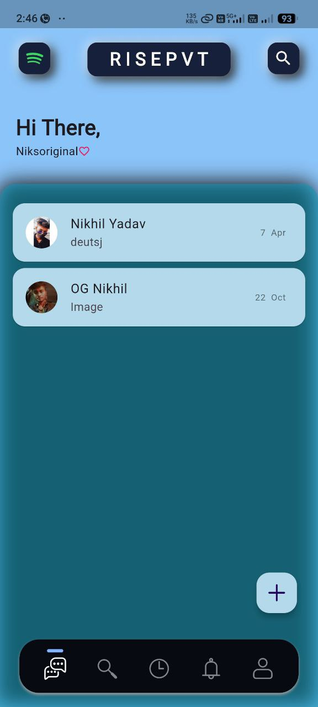

# RISEPVT

**RISEPVT** is a sleek, minimal mobile-first Android application that combines secure messaging and personalized music features in a single platform. Built with clean UI design and smooth user experience in mind, RISEPVT is a personal project by [Nikhil Yadav](https://niksoriginals.netlify.app) to explore full-stack app development with a creative edge.
---

## ✨ Features

- 🔒 Secure login via **Phone** or **Google**
- 💬 Real-time chat UI with profile support
- 🎵 Music tab with audio integration (Spotify-inspired)
- 👤 Editable user profiles with image and info
- 🎨 Smooth, modern UI with blurred backgrounds and gradients
- 📱 Responsive design for mobile and tablet users

---

## 📸 Screenshots

  
  
  

*Want the full app preview? Visit [risepvt.netlify.app](https://risepvt.netlify.app)*

---

## 🛠 Tech Stack

- **Frontend**: HTML, CSS (Tailwind), JavaScript
- **Backend/Services**: Firebase Auth, Firestore (optional)
- **Hosting**: Netlify
- **Design**: Figma + Custom GIFs + Boxicons

---

